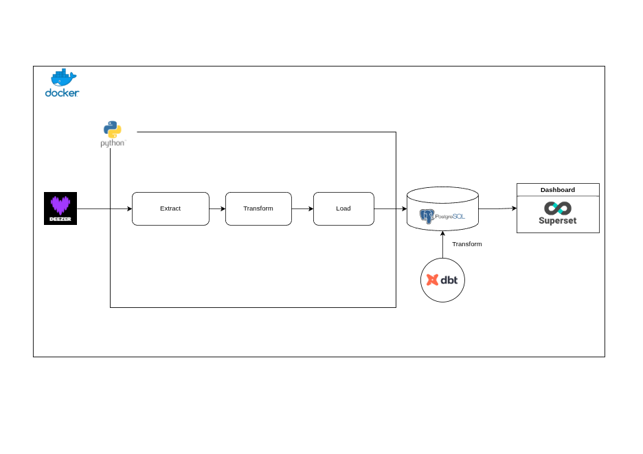

# Deezer Charts ETL
    This is a data pipeline for analyzing and visualizing deezer chart.
    It uses Docker, Python, dbt, and Apache Superset to collect, transform, and display insights from music data.
---

## Project Architecture

```
master
|
├── compose.yml                 # Docker Compose file using prebuilt images (no build required)
├── compose_with_build.yml      # Docker Compose file that builds images locally before running
│
├── python_app/ # Folder contain the configuration for the python etl with dbt
│   ├── Dockerfile
│   ├── requirements.txt        
│   ├── entrypoint.sh           # The startup script for the Python ETL container
│   ├── etl.sh                  # The script for the Python ETL schedulling (0 0 * * *)
│   ├── main.py                 # The python file that performs the ETL
│   ├── crontab                        
│   ├── dbt_project/ # Folder that contain the dbt project
│   │   ├── dbt_project.yml
|   |   |
│   │   ├── models/
│   │   │   ├── example/
│   │   │   │   ├── track_daily.sql         # Transformation to retrieve daily chart
│   │   │   │   ├── track_performance.sql   # Transformation for track performance
│   │   │   │   ├── artist_performance.sql, # Transformation for artist performance
│   │   │   │   └── track_duration.sql      # Transformation for duration analysis
│   │   ├── seeds/
│   │   ├── tests/
│   │   └── macros/
│   └── logs/
│       └── app.log
│
├── superset_init/ The folder that contains the configuration for the dashboard
│   ├── Dockerfile
│   ├── superset_init.sh               # Initialisation script
│   ├── dashboard_export_20251014T004701/ # Configuration Folder that contain the dashboard ans its elements
│   │    
│   │  
```
---

## Run the Project
Clone the repository

```bash
git clone https://github.com/Solobed/docker_final_assignment.git
cd docker_final_assignment
```
### Configuration

Create a .env file with the required environment variables for database access, Superset secret key, and other configuration

Example:
```bash
POSTGRES_USER=your_user
POSTGRES_PASSWORD=your_password
POSTGRES_DB=trackdb
DB_HOST=postgres
DB_USER=your_user
DB_PASSWORD=your_password
DB_NAME=trackdb
SUPERSET_SECRET_KEY=your_secret_key
```

Choose the Docker Compose configuration

```bash
docker compose -f compose_with_build.yml up
```

Or 

```bash
docker compose up -f compose.yml up
```

## Access the dashboards

Open your browser and go to: http://localhost:8088

Log in with the default credentials:
    
    Username: admin
    Password: admin
    

## Useful Links

- Related article for further information: [Deezer Data Pipeline: End-to-End ETL with Python, dbt, and Docker](https://medium.com/@juitdtio/deezer-data-pipeline-end-to-end-etl-with-python-dbt-and-docker-41a3de4f02fd)

---